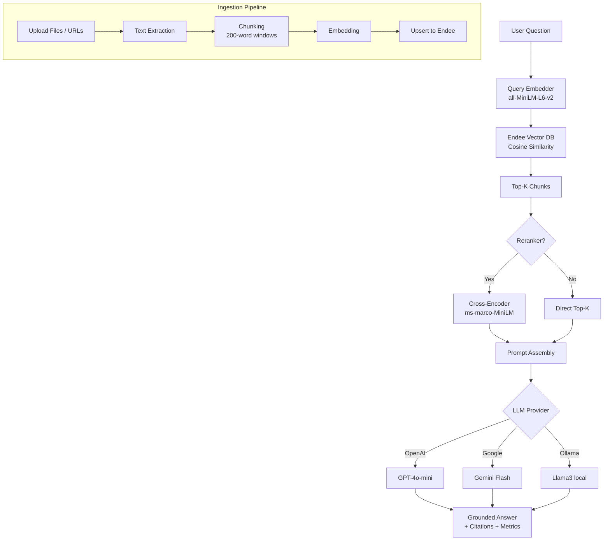

# 📒 Multi-Subject Notes App

> **Your personal AI knowledge base** — upload documents, paste URLs, and ask natural-language questions. Each subject gets its own isolated vector index, powered by [Endee](https://github.com/endee-io/endee) vector database.

[](https://python.org)
[](https://github.com/endee-io/endee)
[](https://gradio.app)
[](LICENSE)

---

## 🎬 Demo

▶️ **[Watch the full demo video on Google Drive](https://drive.google.com/file/d/1h3NxTrNapHnnv7xGO8wKi3xMYP_xPj-x/view?usp=sharing)**

See the app in action — creating subjects, uploading documents, and getting AI-powered answers from your own notes.

---

## 🤔 What Does This App Do?

Think of it as **ChatGPT for your own documents** — but you control the data and can run it entirely offline.

1. **Create a subject** (e.g. "Machine Learning", "History", "Company Docs")
2. **Upload files or paste URLs** — the app chunks, embeds, and indexes them
3. **Ask questions** — the app retrieves relevant context and generates grounded answers with citations

Each subject is **completely isolated**: uploading ML papers won't pollute your History notes.

---

## ✨ Features

| Feature | Details |
|---|---|
| **Multi-subject isolation** | Each subject has its own Endee vector index |
| **Document upload** | `.txt`, `.pdf`, `.md`, `.csv`, `.json` files supported |
| **URL ingestion** | Paste any URL and the content gets scraped automatically |
| **Semantic search** | Dense vector search via `all-MiniLM-L6-v2` embeddings (384-dim) |
| **Cross-encoder reranking** | Optional `ms-marco-MiniLM-L-6-v2` reranker for higher precision |
| **3 LLM backends** | OpenAI, Google Gemini, or Ollama (fully local & free) |
| **Evaluation metrics** | Faithfulness + Answer Relevancy scores on every query |
| **Modern UI** | Dark-themed Gradio interface with example questions |
| **Docker ready** | Full `docker-compose.yml` for one-command deploy |

---

## 📋 Prerequisites

Before you begin, make sure you have:

- **Python 3.11+** — [Download](https://python.org/downloads/)
- **Docker** — [Download](https://docs.docker.com/get-docker/) (needed to run Endee)
- **An LLM API key** (choose one):
  - [OpenAI API Key](https://platform.openai.com/api-keys)
  - [Google AI Studio Key](https://aistudio.google.com/app/apikey)
  - Or [Ollama](https://ollama.ai/) installed locally (free, no key needed)

---

## 🚀 Quick Start

### Step 1: Clone and enter the project

```bash
git clone https://github.com/YOUR_USERNAME/endee-notes-app.git
cd endee-notes-app
```

### Step 2: Start Endee (the vector database)

```bash
docker compose up endee -d
```

Verify it's running:
```bash
curl http://localhost:8080/api/v1/health
# Expected: {"status":"ok"}
```

### Step 3: Set up Python environment

```bash
python -m venv .venv

# macOS / Linux:
source .venv/bin/activate

# Windows:
.venv\Scripts\activate

pip install -r requirements.txt
```

### Step 4: Configure your LLM

```bash
cp .env.example .env
```

Open `.env` and set your LLM provider. For example, to use Google Gemini:

```env
LLM_PROVIDER=google
GOOGLE_API_KEY=your-api-key-here
GOOGLE_MODEL=gemini-3-flash-preview
```

Or for OpenAI:
```env
LLM_PROVIDER=openai
OPENAI_API_KEY=sk-your-key-here
OPENAI_MODEL=gpt-4o-mini
```

Or for Ollama (free, fully local):
```env
LLM_PROVIDER=ollama
OLLAMA_BASE_URL=http://localhost:11434
OLLAMA_MODEL=llama3
```

### Step 5: Launch the app

```bash
python app.py
```

Open your browser to **http://localhost:7860** — you're ready to go! 🎉

---

## 📖 How to Use the App

### Creating a Subject
1. Go to the **📂 Manage Subjects** tab
2. Type a subject name (e.g. "Biology") and click **Create Subject**

### Adding Content
1. In **📂 Manage Subjects**, select your subject from the dropdown
2. Upload files (`.txt`, `.pdf`, etc.) **or** paste URLs (one per line)
3. Click **📤 Process & Add Content**
4. Wait for the confirmation message showing how many vectors were indexed

### Asking Questions
1. Go to the **💬 Ask Your Notes** tab
2. Select a subject from the dropdown
3. Type your question or click one of the example questions
4. Click **🔍 Ask** and wait for the answer

### Understanding the Results
- **📝 Answer** — The AI-generated answer with citations
- **📚 Sources** — Links to the original documents used
- **📊 Metrics** — Faithfulness (is the answer grounded in context?) and Relevancy (is it on-topic?)
- **🔍 Context** — The raw text chunks retrieved from Endee (useful for debugging)

---

## 📁 Project Structure

```
.
├── app.py                # Main entry point — Gradio web UI
├── src/                  # Core application logic
│   ├── config.py         # Centralised config (all env-var driven)
│   ├── rag_chain.py      # RAG pipeline: retrieval → LLM → metrics
│   ├── retriever.py      # Endee query client + cross-encoder reranking
│   ├── ingest.py         # Data ingestion: scrape → chunk → embed → upsert
│   └── subjects_db.py    # JSON store for tracking subjects
├── tests/                # Testing & evaluation
│   ├── evaluate.py       # Offline benchmark evaluation
│   ├── test_ui.py        # Programmatic Gradio UI tests
│   └── test_docs/        # Sample test documents
├── subjects.json         # Auto-generated subject registry
├── requirements.txt      # Python dependencies
├── .env.example          # Environment variable template
├── Dockerfile            # Container for the Python app
├── docker-compose.yml    # Endee + app orchestration
└── README.md             # This file
```

---

## 🏗️ Architecture



### How It Works

1. **Ingestion**: Documents are chunked into ~200-word windows with 40-word overlap, embedded using `all-MiniLM-L6-v2`, and stored in Endee with metadata (title, URL, category).

2. **Retrieval**: When you ask a question, it's embedded and compared against the index using cosine similarity. The top-K results are optionally reranked with a cross-encoder for better precision.

3. **Generation**: Retrieved chunks are assembled into a context-aware prompt and sent to your configured LLM. The answer includes inline citations to sources.

4. **Evaluation**: Faithfulness (answer ↔ context similarity) and relevancy (question ↔ answer similarity) are computed using embedding cosine similarity.

---

## ⚙️ Configuration Reference

All settings are controlled via environment variables (`.env` file):

| Variable | Default | Description |
|---|---|---|
| `ENDEE_HOST` | `http://localhost:8080` | Endee server URL |
| `LLM_PROVIDER` | `openai` | LLM backend: `openai`, `google`, or `ollama` |
| `OPENAI_API_KEY` | — | Your OpenAI API key |
| `OPENAI_MODEL` | `gpt-4o-mini` | OpenAI model to use |
| `GOOGLE_API_KEY` | — | Your Google AI Studio key |
| `GOOGLE_MODEL` | `gemini-3-flash-preview` | Google model to use |
| `OLLAMA_BASE_URL` | `http://localhost:11434` | Ollama server URL |
| `OLLAMA_MODEL` | `llama3` | Ollama model name |
| `EMBED_MODEL` | `all-MiniLM-L6-v2` | Sentence-transformers embedding model |
| `EMBED_DIM` | `384` | Embedding dimensionality |
| `CHUNK_SIZE` | `200` | Words per chunk |
| `CHUNK_OVERLAP` | `40` | Overlapping words between chunks |
| `TOP_K` | `5` | Number of retrieval candidates |
| `RERANK_TOP_N` | `3` | Results kept after reranking |
| `APP_PORT` | `7860` | Gradio UI port |
| `DEBUG` | `false` | Enable debug logging |

---

## 🐳 Docker Setup

Run everything with a single command:

```bash
# Start Endee + the web app
docker compose up -d

# Check logs
docker compose logs -f app

# Stop everything
docker compose down
```

The Docker setup includes:
- **Endee** — Vector database on port `8080`
- **App** — Gradio UI on port `7860`
- **Persistent data** — Endee data stored in a named Docker volume

---

## 🧪 Testing

### Evaluation Benchmark

Run the built-in evaluation against your indexed data:

```bash
python -m tests.evaluate --index <your_index_name>
```

This runs 10 benchmark questions and reports average faithfulness, relevancy, and latency.

### UI Tests

With the app running, test the API endpoints programmatically:

```bash
python tests/test_ui.py
```

---

## 🔧 Troubleshooting

| Problem | Solution |
|---|---|
| **`Connection refused` on query** | Make sure Endee is running: `docker compose up endee -d` |
| **`No context retrieved`** | You need to ingest documents first — go to Manage Subjects tab |
| **`[LLM Error]`** | Check your API key in `.env` and ensure it's valid |
| **App won't start** | Run `pip install -r requirements.txt` to ensure all deps are installed |
| **Slow first query** | Normal — embedding models are downloaded on first run (~100MB) |
| **Docker build fails** | Ensure Docker Desktop is running and has internet access |
| **Port 7860 in use** | Change `APP_PORT` in `.env` to another port |

---

## 🛣️ Roadmap

- [ ] Hybrid search (dense + BM25 sparse) via Endee sparse vectors
- [ ] Streaming LLM responses
- [ ] Conversation history / follow-up questions
- [ ] Multi-document upload with drag-and-drop
- [ ] Export answers as Markdown/PDF

---

## ⚠️ Known Limitations

| Limitation | Details |
|---|---|
| **Endee must be running locally** | The app depends on Endee vector database running on `localhost:8080`. If Endee is not started via Docker before launching the app, all ingestion and query operations will fail with a `Connection refused` error. |
| **No conversation history** | Each question is answered independently. The LLM has no memory of previous questions in the same session — follow-up questions require repeating context manually. |
| **Cold-start model loading** | On the first query of a session, the `all-MiniLM-L6-v2` embedding model and the cross-encoder reranker are downloaded (~100 MB total) and loaded into memory. This causes a noticeable delay (~10–20 seconds) on first use. |
| **PDF text extraction only** | For PDF files, only embedded text is extracted. Scanned PDFs or image-based PDFs (without OCR) will produce empty or near-empty content, resulting in no useful vectors being indexed. |
| **Single-user local deployment** | The app is designed for personal, single-user use. There is no authentication, user management, or multi-tenancy — running it on a public server would expose all data to anyone with the URL. |
| **LLM hallucination risk** | Like all RAG systems, the quality of answers depends on the relevance of retrieved chunks. If the indexed content doesn't contain the answer, the LLM may hallucinate plausible-sounding but incorrect information. |
| **Chunk size is fixed** | Documents are chunked into fixed ~200-word windows with 40-word overlap. Very short documents (e.g., a single paragraph) may produce only one chunk, reducing retrieval diversity. Very long documents may produce many chunks, increasing memory usage. |
| **No real-time URL updates** | Web pages ingested via URL are scraped once at upload time. Any subsequent changes to the source page are not reflected unless the URL is re-ingested with the "Reset index" option enabled. |
| **Metrics are approximations** | Faithfulness and Answer Relevancy scores are computed using cosine similarity between embeddings — they are useful indicators but not rigorous evaluation metrics. |

---

## 📄 License

Apache 2.0 — see [LICENSE](LICENSE).

---

## 🙏 Acknowledgements

- [Endee](https://github.com/endee-io/endee) — Open-source vector database
- [sentence-transformers](https://www.sbert.net/) — Embedding models
- [Gradio](https://gradio.app/) — UI framework
- [Google Fonts (Inter)](https://fonts.google.com/specimen/Inter) — Typography
