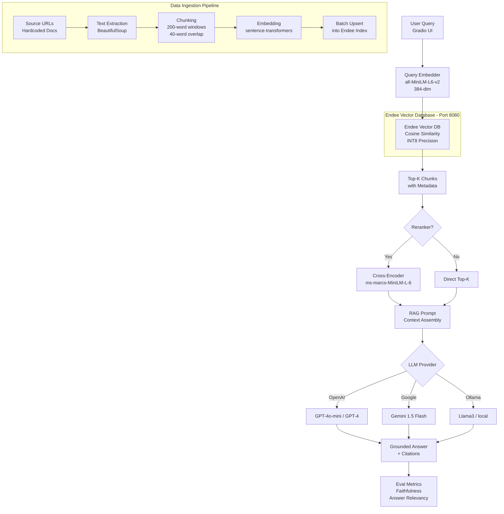

# Multi-Subject Notes App

> **Semantic search + RAG over personal notes** — powered by [Endee Vector Database](https://github.com/endee-io/endee), the high-performance open-source vector store designed to handle up to 1B vectors on a single node.

[](https://python.org)
[](https://github.com/endee-io/endee)
[](LICENSE)
[](https://gradio.app)

---

## What Is This?

This project is a **Multi-Subject AI Notes Application** that uses a system-level architecture to combine:

- 📦 **External vector stores** (like Endee) for persistent memory
- 🔍 **Retrieval-Augmented Generation (RAG)** to fetch only what's needed
- 📄 **Artifacts** (plans, logs, walkthroughs) as durable structured state
- 🤖 **Multi-agent orchestration** for long-horizon tasks

This project demonstrates that architecture by building a **complete production-style RAG system** over your own notes and documentation, queryable through a brutalist Gradio UI.

---

## System Architecture



---

## Features

| Feature | Details |
|---|---|
| **Vector Store** | Endee (cosine similarity, INT8 precision, metadata filtering) |
| **Embeddings** | `sentence-transformers/all-MiniLM-L6-v2` (384-dim, local, free) |
| **Hybrid-ready** | Endee supports dense + sparse (BM25) retrieval |
| **Reranking** | `cross-encoder/ms-marco-MiniLM-L-6-v2` for improved precision |
| **LLM backends** | OpenAI, Google Gemini, Ollama (local) |
| **Eval metrics** | Faithfulness + Answer Relevancy (cosine similarity-based) |
| **UI** | Gradio with dark glassmorphism theme |
| **Production features** | Docker, async-ready, metadata filters, error handling |

---

## Project Structure

```
.
├── app.py              # Gradio web UI (main entry point)
├── requirements.txt    # Python dependencies
├── Dockerfile          # Container for the Python app
├── docker-compose.yml  # Endee + RAG app orchestration
├── .env.example        # Environment variable template
├── README.md           # This file
├── src/                # Core Application Logic
│   ├── config.py       # Centralised configuration (env-var driven)
│   ├── rag_chain.py    # RAG pipeline: retrieval → LLM → metrics
│   ├── retriever.py    # Endee query client + cross-encoder reranking
│   ├── ingest.py       # Data ingestion: scrape → chunk → embed → upsert
│   ├── subjects_db.py  # Local JSON database for tracking multiple subjects
│   └── subjects.json   # JSON storage for subjects tracking
└── tests/              # Testing and Evaluation
    ├── evaluate.py     # Offline evaluation on benchmark questions
    ├── test_ui.py      # Programmatic tests for Gradio UI endpoints
    └── test_docs/      # Sample mock documents for testing
```

---

## Quick Start (2-Day Runbook)

### Day 1: Setup & Indexing

**Step 1 – Clone and configure**
```bash
git clone https://github.com/YOUR_USERNAME/endee-notes-app.git
cd endee-antigravity-rag
cp .env.example .env
# Edit .env with your LLM API key
```

**Step 2 – Start Endee**
```bash
docker compose up endee -d

# Verify it's healthy
curl http://localhost:8080/api/v1/health
# Expected: {"status":"ok"}
```

**Step 3 – Install Python dependencies**
```bash
python -m venv .venv && source .venv/bin/activate  # macOS/Linux
# OR: python -m venv .venv && .venv\Scripts\activate  # Windows
pip install -r requirements.txt
```

**Step 4 – Ingest documents into Endee**
```bash
python ingest.py
# To reset and re-ingest:
python ingest.py --reset
```

### Day 2: Query & Evaluate

**Step 5 – Launch the Gradio UI**
```bash
python app.py
# Open: http://localhost:7860
```

**Step 6 – Run evaluation (optional)**
```bash
python evaluate.py
# Results saved to: eval_results.json
```

---

## 🐳 Full Docker Setup

```bash
# Start Endee + the RAG app together
docker compose up -d

# Ingest documents (one-shot)
docker compose --profile ingest up ingest

# View logs
docker compose logs -f app

# Stop everything
docker compose down
```

---

## ⚙️ Configuration

All settings are driven by environment variables (see `.env.example`):

| Variable | Default | Description |
|---|---|---|
| `ENDEE_HOST` | `http://localhost:8080` | Endee server URL |
| `INDEX_NAME` | `antigravity_rag` | Endee index name |
| `LLM_PROVIDER` | `openai` | `openai` / `google` / `ollama` |
| `OPENAI_API_KEY` | — | OpenAI secret key |
| `GOOGLE_API_KEY` | — | Google AI Studio key |
| `OLLAMA_MODEL` | `llama3` | Local Ollama model name |
| `EMBED_MODEL` | `all-MiniLM-L6-v2` | Sentence-transformers model |
| `EMBED_DIM` | `384` | Embedding dimensionality |
| `CHUNK_SIZE` | `200` | Words per chunk |
| `CHUNK_OVERLAP` | `40` | Overlap words between chunks |
| `TOP_K` | `5` | Retrieval candidates |
| `RERANK_TOP_N` | `3` | Final results after reranking |

---

## 🔌 Endee Vector Database

[Endee](https://github.com/endee-io/endee) is an open-source, high-performance vector database:

- **Up to 1B vectors** on a single node
- **Hybrid search**: dense + sparse (BM25) retrieval
- **Payload filtering**: metadata-aware queries
- **Python SDK**: `pip install endee`
- **Docker**: `ghcr.io/endee-io/endee:latest`

### How This Project Uses Endee

```python
from endee import Endee, Precision

# Connect
client = Endee()
client.set_base_url("http://localhost:8080/api/v1")

# Create index (cosine, INT8 for memory efficiency)
client.create_index(
    name="antigravity_rag",
    dimension=384,
    space_type="cosine",
    precision=Precision.INT8,
)

# Upsert vectors with metadata
index = client.get_index("antigravity_rag")
index.upsert([{
    "id": "chunk-abc123",
    "vector": [0.1, 0.3, ...],  # 384-dim embedding
    "meta": {
        "title": "Antigravity Infinite Context",
        "url": "https://...",
        "category": "architecture",
        "chunk_text": "The trick is routing the right sliver...",
    }
}])

# Query top-5 similar chunks
results = index.query(vector=[...], top_k=5)
```

---

## 📊 Evaluation Metrics

The system computes two lightweight metrics locally (no external eval library):

| Metric | Method | Interpretation |
|---|---|---|
| **Faithfulness** | Cosine similarity (answer ↔ context) | How grounded is the answer in retrieved context? |
| **Answer Relevancy** | Cosine similarity (question ↔ answer) | How on-topic is the answer? |

Run the full benchmark:
```bash
python evaluate.py
```

Sample output:
```
============================================================
📊 RAG Evaluation Report
============================================================
Total Questions:      10
Avg Faithfulness:     0.712  (higher = more grounded)
Avg Answer Relevancy: 0.683  (higher = more on-topic)
Avg Latency:          2.34s
============================================================
```

---

## 🛣️ Roadmap

- [ ] Hybrid search (dense + BM25 sparse) via Endee sparse vectors
- [ ] Streaming LLM responses in Gradio
- [ ] RAGAS-based evaluation with ground truth answers
- [ ] Persistent conversation history in Endee (agentic memory)
- [ ] Multi-document upload UI
- [ ] LangChain / LlamaIndex integration example

---

## 📄 License

Apache 2.0 — see [LICENSE](LICENSE).

---

## 🙏 Acknowledgements

- [Endee](https://github.com/endee-io/endee) — Open-source vector database
- [sentence-transformers](https://www.sbert.net/) — Embedding models
- [Gradio](https://gradio.app/) — UI framework
- [Skywork AI](https://skywork.ai/blog/ai-agent/antigravity-infinite-context-window-ultimate-guide/) — Antigravity infinite context guide
